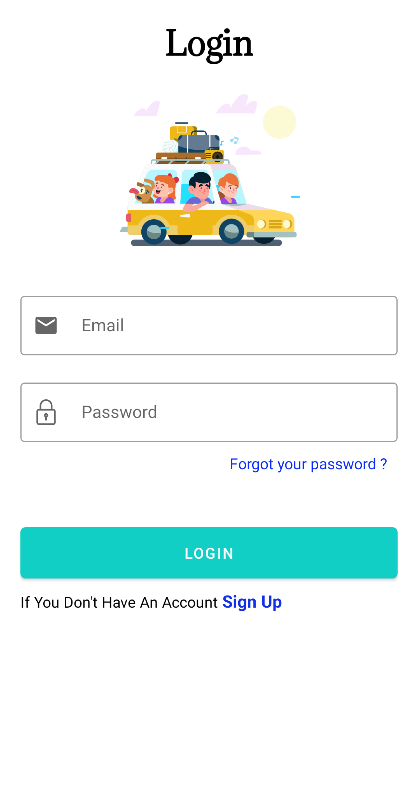
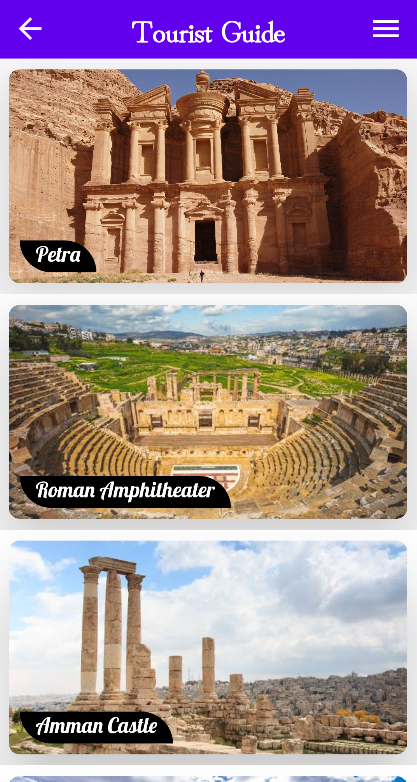
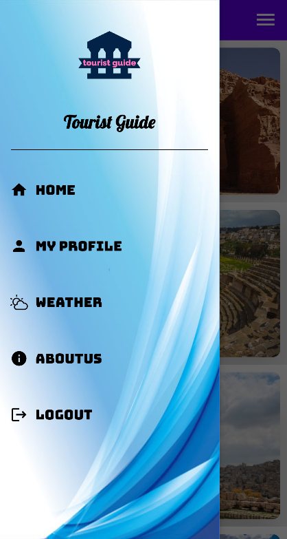
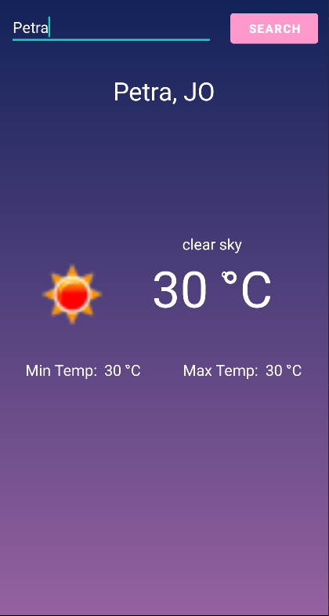
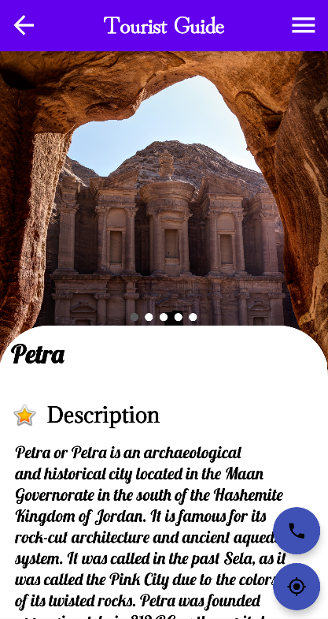
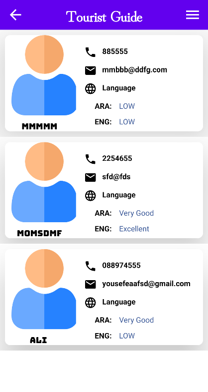
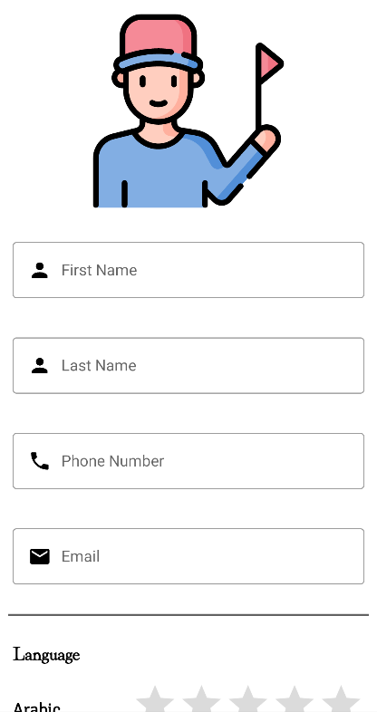
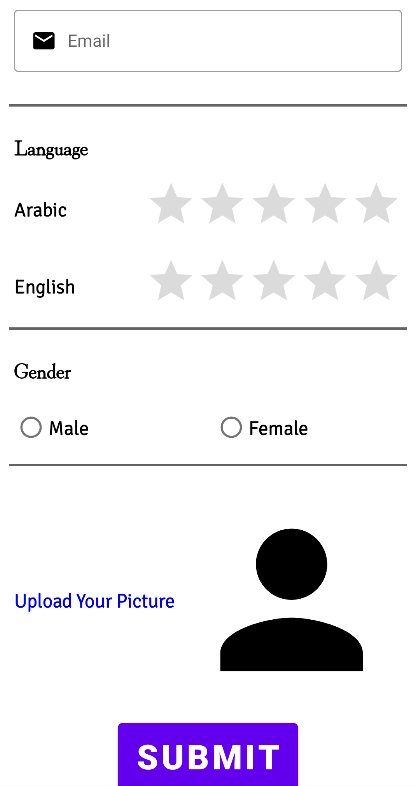

# Tourist Guide App

The tourist guide application provides information and pictures about the ancient archaeological sites in Jordan for users and also allows registration for the tourist guide as a service for tourists with a full display of the guide information such as photo, phone number and email, and the ability to request the guide from the user.
It also provides archaeological sites on the map, and through the application, the automatic reading feature can be turned on for a better and easier user experience
The target audience for the tour guide application can be generally tourists or non-Jordanians. With just a few clicks on the app, you can see and read the correct information about Jordanian archaeological sites.

## App Features

1. The user can create account then login to the Tourist Guide App.
2. The user may be Tourist or Guide.
3. The Guide can rejester to the App to help The Tourist.
4. The user will find all Jordanian archaeological sites and correct information about it.
5. Use Google Map to direct the user for any Jordanian archaeological sites.
6. The Tourist user can request the help from any Guide found in The App.
7. Weather condition for any location the.

## Screenshots

|        |  |                     |
| :---------- | :--------:  |       ----------:        |
|   |       |       |
|   |       |       |
|   |       |       |
|   |       |       |
|   |       |       |
